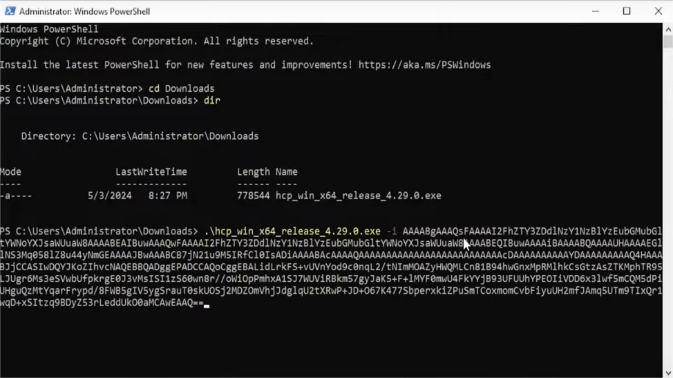
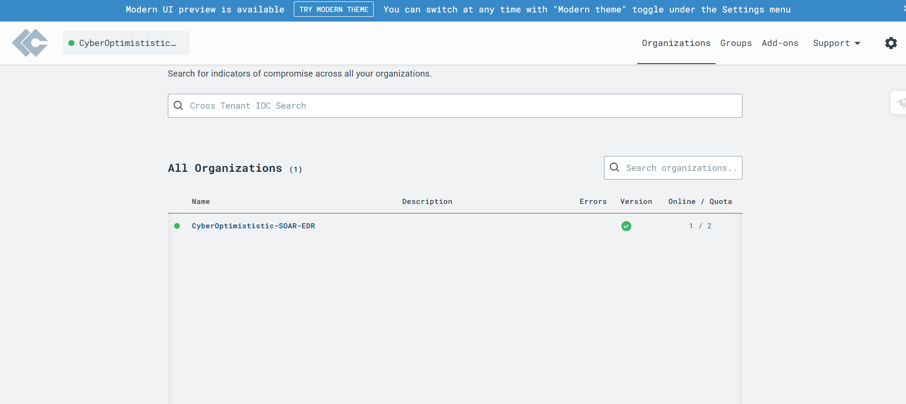
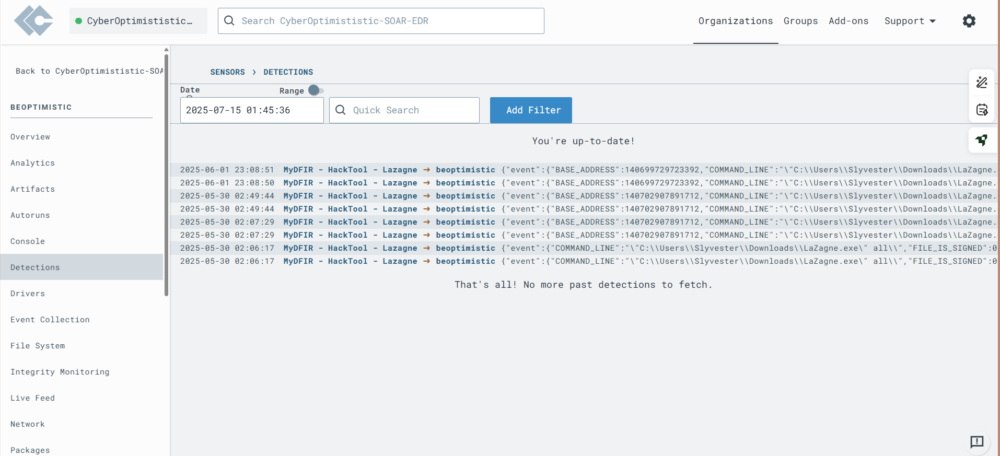

# ⚙️ Part Two: Setting Up LimaCharlie & Connecting Endpoints

## 🎯 Objective

In this step, we'll install the **LimaCharlie EDR agent** on a Windows system, verify connectivity, and create our first detection rule. This rule will trigger the automated response playbook defined in [Part One](./part-one-playbook.md).

---

## 💻 1. Install the LimaCharlie Agent

Use either:
- A Windows **Virtual Machine** (e.g., VirtualBox, VMware)
- A physical **Windows laptop**

Make sure the device:
- Has internet access
- Can run PowerShell as Admin

  ### 🔽 Installation Steps

1. Go to your LimaCharlie **Organization Dashboard**
2. Navigate to **Sensors** → **Add Sensor**
3. Choose:
   - **Operating System**: Windows
   - **Architecture**: 64-bit or 32-bit


4. Copy the PowerShell installation command, for example:

    ```powershell
    powershell -Command "& { iwr -useb https://your-org.limacharlie.io/install.ps1 | iex }"
    ```

5. Paste and run the command in **PowerShell (as Administrator)** on your Windows machine.
   

## ✅ 2. Verify Agent Connection

After installation, verify that the agent is reporting to LimaCharlie.

Head to the **Sensors** tab in the LimaCharlie dashboard.  
Your Windows machine should appear as **Online** and actively reporting events (e.g., `NEW_PROCESS`, `DNS_REQUEST`, `FILE_WRITE`).

---

### 🔧 Manual Agent Installation via Command Line

If you're installing the agent manually (e.g., using an `.msi` file from LimaCharlie), follow these steps:

1. Open **Command Prompt or PowerShell as Administrator**

2. Navigate to the Downloads folder:

    ```bash
    cd Downloads
    ```

3. List the files in the folder:

    ```bash
    dir
    ```

4. Start typing the installer name (usually starts with `hcp`) and press `Tab` to auto-complete:

    ```bash
    hcp
    ```

5. Type the installation command with your unique key:

    ```bash
    hcp -i YOUR_INSTALLATION_KEY
    ```

6. Press **Enter**  
   You should see a message like:

    ```
    Agent installed successfully and is now reporting to LimaCharlie.
    ```

---

### 🧪 Trigger Some Test Events

To make sure the agent is sending logs:

- Open **Notepad**, **CMD**, or **PowerShell**
- Browse some websites
- Run common system commands

These actions should generate logs like `NEW_PROCESS` or `DNS_REQUEST`, visible in the **Events**, **Timeline**, or **Artifacts** section of the LimaCharlie dashboard.

## 🔹 📂 Part Two: Agent Setup & Detection Rule

### 🖼️ 1. PowerShell Installation of LimaCharlie Agent

  
This screenshot shows the process of installing the LimaCharlie agent via PowerShell with administrative privileges.

---

### 🖼️ 2. Endpoint Appears in LimaCharlie Dashboard

  
Here, the Windows endpoint successfully appears as "Online" in the LimaCharlie console under the **Sensors** tab.

---

### 🖼️ 3. Event Logs in LimaCharlie (NEW_PROCESS, DNS_REQUEST)

  
After running test activities, LimaCharlie begins logging system events like `NEW_PROCESS` and `DNS_REQUEST`, confirming that the agent is active.

